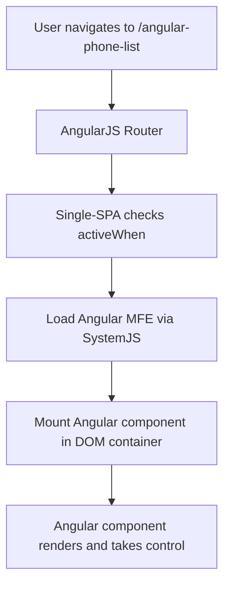
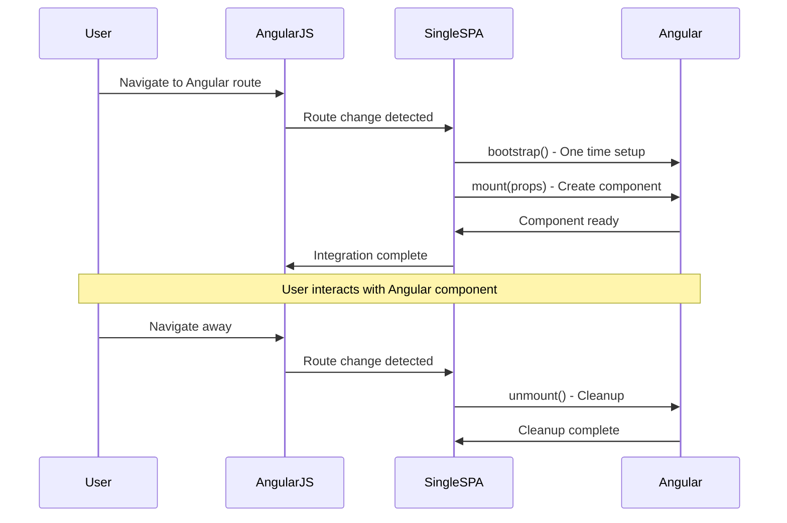

# Angular-in-AngularJS Architecture Overview
**High-Level Technical Strategy for Micro-Frontend Integration**

---

## 🎯 Executive Summary

This document outlines a **micro-frontend architecture** that enables **modern Angular components** to run seamlessly within **legacy AngularJS applications**. This approach provides a **gradual migration path** without requiring a complete application rewrite, significantly reducing risk and development time while modernizing user experiences.

---

## 🏗️ Architecture Overview

### Core Concept
Instead of a monolithic frontend, we implement a **host-child architecture** where:
- **AngularJS** acts as the **host application** (container)
- **Angular** components run as **micro-frontends** (children)
- **Single-SPA** orchestrates the integration and lifecycle management

```
┌─────────────────────────────────────────────────────────────┐
│                    AngularJS Host Application               │
│  ┌─────────────────────┐    ┌─────────────────────────────┐ │
│  │   AngularJS Route   │    │      Angular MFE Route      │ │
│  │   /phones           │    │   /angular-phone-list       │ │
│  │                     │    │                             │ │
│  │ ┌─────────────────┐ │    │ ┌─────────────────────────┐ │ │
│  │ │ Phone List      │ │    │ │   Modern Phone List     │ │ │
│  │ │ (AngularJS)     │ │    │ │   (Angular 15+)         │ │ │
│  │ └─────────────────┘ │    │ └─────────────────────────┘ │ │
│  └─────────────────────┘    └─────────────────────────────┘ │
│                                                             │
│  Navigation, Authentication, Global State Management       │
└─────────────────────────────────────────────────────────────┘
```

---

## 🔧 Technical Stack

### AngularJS Host (Container)
- **AngularJS 1.8.x** - Legacy application framework
- **Single-SPA 5.x** - Micro-frontend orchestration
- **SystemJS 6.x** - Dynamic module loading
- **Existing Infrastructure** - Authentication, routing, global services

### Angular Micro-Frontend (Child)
- **Angular 15+** - Modern component framework
- **TypeScript 4.8+** - Type-safe development
- **Webpack 5** - Module bundling and hot reloading
- **Standalone Components** - Simplified bootstrapping
- **RxJS 7** - Reactive programming

### Integration Layer
- **Single-SPA Lifecycle** - Mount/unmount management
- **SystemJS Import Maps** - Module resolution
- **Custom Events** - Cross-framework communication
- **Shared DOM Container** - Component rendering target

---

## 🌊 Data Flow Architecture

### 1. Route-Based Activation


### 2. Component Lifecycle


### 3. Cross-Framework Communication
```
┌─────────────────┐    Custom Events    ┌─────────────────┐
│   AngularJS     │ ◄─────────────────► │    Angular      │
│                 │                     │                 │
│ • Navigation    │    window.dispatch  │ • User Actions  │
│ • Global State  │    Event Listeners  │ • Data Updates  │
│ • Auth Status   │                     │ • Route Changes │
└─────────────────┘                     └─────────────────┘
```

---

## 🎯 Benefits & Value Proposition

### Business Benefits
- ✅ **Reduced Risk** - Gradual migration without big-bang rewrites
- ✅ **Faster Time-to-Market** - Modern features delivered incrementally
- ✅ **Cost Effective** - Preserve existing investments while modernizing
- ✅ **Parallel Development** - Teams can work on different frameworks simultaneously
- ✅ **User Experience** - Immediate access to modern UI components

### Technical Benefits
- ✅ **Technology Independence** - Angular and AngularJS evolve separately
- ✅ **Independent Deployment** - Micro-frontends can be deployed independently
- ✅ **Modern Development Experience** - TypeScript, modern tooling, latest Angular features
- ✅ **Performance Isolation** - Issues in one framework don't affect the other
- ✅ **Future-Proof Architecture** - Clear path to complete Angular migration

---

## 🏛️ Implementation Strategy

### Phase 1: Foundation Setup (1-2 weeks)
- **Install and configure** Single-SPA in AngularJS host
- **Create Angular MFE** project structure
- **Implement basic integration** with hello-world component
- **Set up development workflow** and build processes

### Phase 2: Core Components (2-4 weeks)
- **Migrate high-value components** to Angular (phone lists, forms)
- **Implement cross-framework** communication patterns
- **Add shared services** for data access
- **Create reusable component library**

### Phase 3: Advanced Features (4-8 weeks)
- **Implement routing** coordination between frameworks
- **Add state management** for cross-framework data sharing
- **Performance optimization** and lazy loading
- **Testing strategy** for integrated applications

### Phase 4: Scale & Optimize (ongoing)
- **Migrate additional components** based on business priority
- **Monitor performance** and optimize bundle sizes
- **Train development teams** on new architecture
- **Plan eventual complete migration** to Angular

---

## 🔐 Security & Performance Considerations

### Security
- **Consistent Authentication** - Single auth system across frameworks
- **CORS Configuration** - Proper cross-origin resource sharing
- **Content Security Policy** - Updated CSP for dynamic module loading
- **Input Sanitization** - Maintained across framework boundaries

### Performance
- **Bundle Size Management** - Shared dependencies to reduce duplication
- **Lazy Loading** - Load Angular components only when needed
- **Memory Management** - Proper cleanup in unmount lifecycle
- **Caching Strategy** - Efficient loading of micro-frontend assets

### Monitoring
- **Error Tracking** - Separate error tracking for each framework
- **Performance Metrics** - Monitor loading times and user interactions
- **Usage Analytics** - Track adoption of new Angular components
- **Bundle Analysis** - Regular analysis of bundle sizes and dependencies

---

## 🚀 Migration Roadmap

### Short Term (0-6 months)
1. **Proof of Concept** - Single Angular component integration
2. **Core UI Components** - Forms, lists, modals
3. **Data Integration** - Connect to existing APIs
4. **Developer Training** - Team onboarding and documentation

### Medium Term (6-18 months)
1. **Feature Parity** - Major features available in Angular
2. **User Preference** - Optional Angular UI for power users
3. **Performance Optimization** - Bundle splitting and lazy loading
4. **Advanced Patterns** - Shared state management

### Long Term (18+ months)
1. **Primary Interface** - Angular becomes the main UI
2. **Legacy Support** - AngularJS for specific legacy features only
3. **Complete Migration** - Full transition to Angular when ready
4. **Modern Infrastructure** - Updated build, deploy, and monitoring

---

## 📊 Success Metrics

### Technical Metrics
- **Bundle Size** - Keep total application size reasonable
- **Loading Performance** - Micro-frontend load times < 500ms
- **Error Rates** - No increase in application errors
- **Development Velocity** - Faster feature development in Angular

### Business Metrics
- **User Adoption** - Usage of new Angular components
- **Developer Satisfaction** - Team feedback on development experience
- **Maintenance Costs** - Reduced time spent on legacy code issues
- **Feature Delivery** - Faster delivery of new user-facing features

---

## 🎓 Team Requirements

### Skills Needed
- **Angular Expertise** - Modern Angular development patterns
- **Micro-Frontend Architecture** - Understanding of distributed frontend systems
- **Integration Patterns** - Cross-framework communication
- **DevOps Knowledge** - Webpack, bundling, deployment strategies

### Training Areas
- **Single-SPA Framework** - Micro-frontend orchestration
- **Angular Standalone Components** - Modern Angular architecture
- **Cross-Framework Patterns** - Communication and state management
- **Performance Optimization** - Bundle analysis and optimization

---

## 🔮 Future Considerations

### Technology Evolution
- **Angular Updates** - Stay current with Angular releases
- **Micro-Frontend Standards** - Adopt emerging standards and best practices
- **Module Federation** - Consider Webpack 5 Module Federation for advanced scenarios
- **Web Components** - Potential future migration to framework-agnostic components

### Scaling Strategies
- **Multiple Micro-Frontends** - Additional frameworks if needed (React, Vue)
- **Shared Design System** - Consistent UI across all micro-frontends
- **Micro-Services Integration** - Align frontend and backend architecture
- **Edge Deployment** - CDN strategies for global micro-frontend delivery

---

## ✅ Conclusion

This micro-frontend architecture provides a **pragmatic, low-risk approach** to modernizing large AngularJS applications. By enabling **gradual migration** while maintaining **full functionality**, organizations can:

- **Preserve existing investments** in AngularJS code and team knowledge
- **Immediately benefit** from modern Angular features and development experience  
- **Reduce project risk** by avoiding big-bang rewrites
- **Maintain development velocity** throughout the migration process
- **Future-proof** their application architecture for continued evolution

The combination of **Single-SPA, Angular 15+, and strategic integration patterns** creates a robust foundation for **long-term application modernization** while delivering **immediate value** to both developers and end users.

---

*This architecture enables organizations to modernize their frontend applications incrementally, reducing risk while maximizing the value of both legacy and modern technology investments.*
