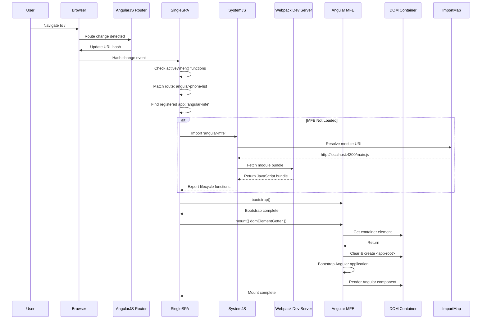
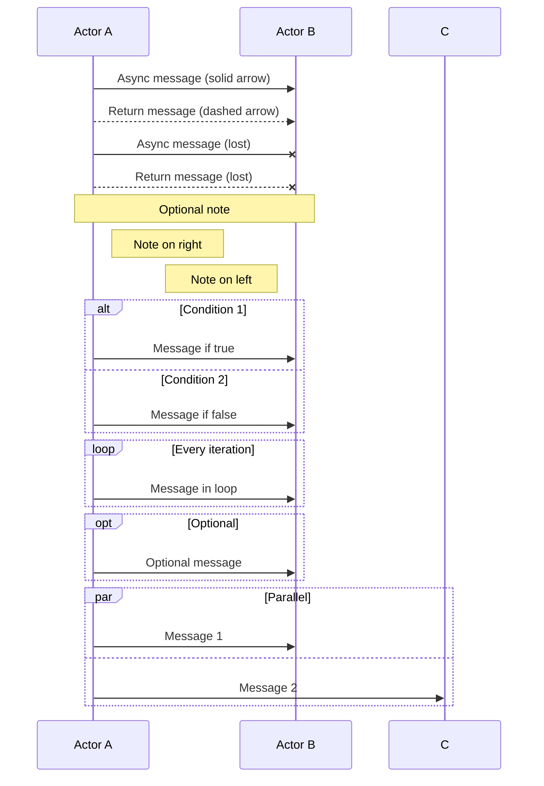
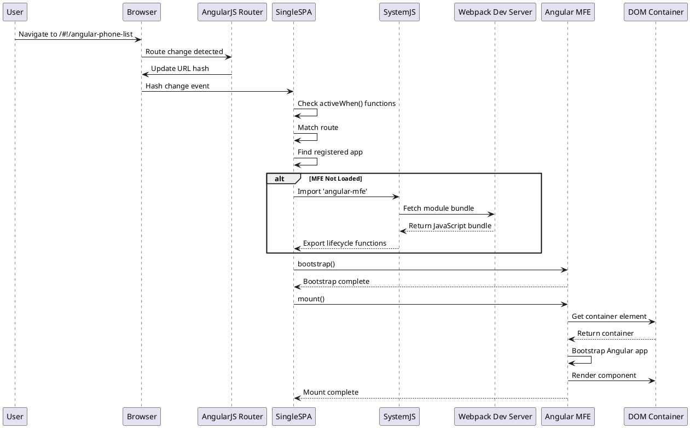
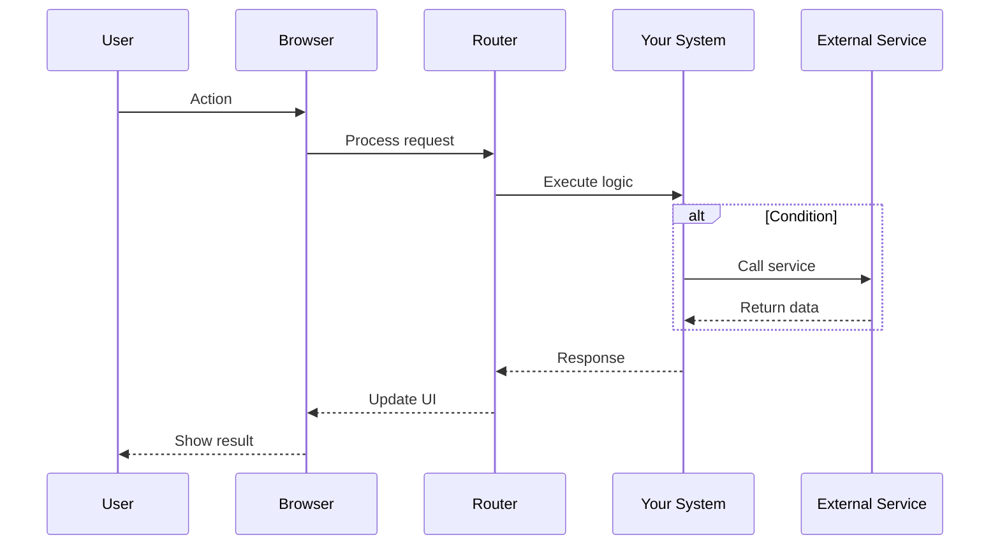
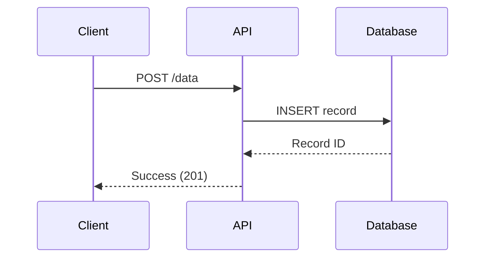
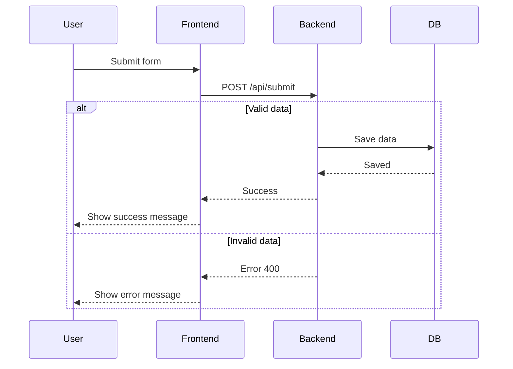
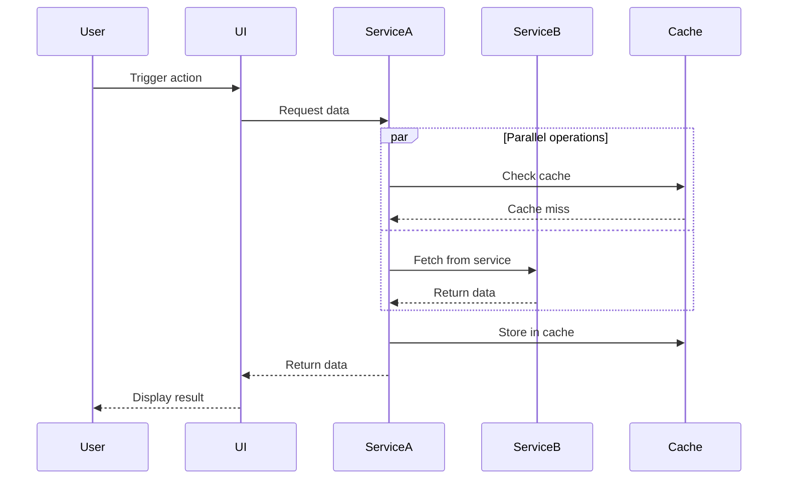

# Diagram Design Guide
**How to Design and Develop Sequence Diagrams & Architecture Diagrams**

---

## 🎯 Tools for Creating Diagrams

### 1. **Mermaid (Code-Based) - Recommended for Your Project**

#### Why Mermaid?
- ✅ **Text-based** - Version control friendly
- ✅ **Easy to edit** - Just edit text
- ✅ **Free & Open Source**
- ✅ **Integrates with Markdown** - Perfect for documentation
- ✅ **Multiple diagram types** - Sequence, flowchart, state, etc.

#### Installation:
```bash
npm install -g @mermaid-js/mermaid-cli
# OR
npm install -g mermaid
```

#### Online Editor:
- **Mermaid Live Editor**: https://mermaid.live
- **Mermaid Chart**: https://www.mermaidchart.com

#### Example: Sequence Diagram (Runtime Flow)


#### Key Mermaid Syntax for Sequence Diagrams:



---

### 2. **Draw.io / diagrams.net (Visual Drag-and-Drop)**

#### Why Draw.io?
- ✅ **Visual editor** - Drag and drop
- ✅ **Free** - No account needed
- ✅ **Export to multiple formats** - PNG, SVG, PDF, PPTX
- ✅ **Online & Desktop versions**
- ✅ **Sequence diagram templates**

#### Access:
- **Online**: https://app.diagrams.net
- **Desktop**: Download from https://github.com/jgraph/drawio-desktop/releases

#### Steps to Create Sequence Diagram:
1. Go to https://app.diagrams.net
2. Create new diagram
3. Select **"Sequence"** template
4. Drag actors from left panel
5. Add messages between actors
6. Add activation boxes, notes, loops
7. Export as PNG/SVG/PDF

#### Tips:
- Use **"Sequence"** category in shapes panel
- Use **"Lifeline"** shapes for actors
- Use **"Message"** connectors for interactions
- Use **"Activation"** boxes to show active periods

---

### 3. **PlantUML (Code-Based Alternative)**

#### Why PlantUML?
- ✅ **Text-based** - Like Mermaid
- ✅ **More features** - Very powerful
- ✅ **Many diagram types**
- ✅ **Integration with IDEs**

#### Installation:
```bash
# Requires Java
brew install plantuml  # macOS
# OR download from http://plantuml.com/download
```

#### Example Sequence Diagram:


#### Online Editor:
- **PlantUML Server**: http://www.plantuml.com/plantuml/uml/

---

### 4. **Lucidchart (Professional Tool)**

#### Why Lucidchart?
- ✅ **Professional appearance**
- ✅ **Collaboration features**
- ✅ **Templates library**
- ⚠️ **Paid** (Free tier available)

#### Access:
- https://www.lucidchart.com

---

### 5. **Excalidraw (Hand-drawn Style)**

#### Why Excalidraw?
- ✅ **Beautiful hand-drawn style**
- ✅ **Free & Open Source**
- ✅ **Simple and intuitive**
- ✅ **Good for presentations**

#### Access:
- **Online**: https://excalidraw.com
- **GitHub**: https://github.com/excalidraw/excalidraw

---

## 📐 Designing "Runtime Flow: Request to Render" Diagram

### Step-by-Step Design Process:

#### 1. **Identify Participants (Actors)**
List all entities involved in the flow:
- User
- Browser
- AngularJS Router
- Single-SPA
- SystemJS
- Webpack Dev Server
- Angular MFE
- DOM Container

#### 2. **Determine Message Flow**
Map the interaction sequence:
1. User initiates action (navigation)
2. Browser receives event
3. Router processes route
4. Single-SPA checks conditions
5. SystemJS loads module
6. Module executes
7. Component renders

#### 3. **Add Conditional Logic**
Identify branches:
- `alt` blocks for conditions (e.g., "MFE Not Loaded")
- `opt` for optional steps
- `loop` for iterations

#### 4. **Add Return Messages**
Show responses:
- Use `-->>` for return arrows
- Show data/status returns

#### 5. **Add Notes for Clarity**
Explain complex steps:
- Use `Note over` for annotations
- Add timing information if needed

---

## 🎨 Best Practices for Sequence Diagrams

### 1. **Keep It Simple**
- ✅ **8-10 participants maximum** - More becomes cluttered
- ✅ **Focus on main flow** - Hide implementation details
- ✅ **Group related operations** - Use alt/loop blocks

### 2. **Clear Naming**
- ✅ **Descriptive participant names** - Use aliases if needed
- ✅ **Action-oriented messages** - "Navigate to", "Fetch bundle"
- ✅ **Show return values** - Help understand data flow

### 3. **Logical Flow**
- ✅ **Left to right** - User on left, systems on right
- ✅ **Top to bottom** - Time flows downward
- ✅ **Group related interactions** - Keep related messages together

### 4. **Visual Clarity**
- ✅ **Consistent styling** - Same colors for same types
- ✅ **Adequate spacing** - Don't cram elements
- ✅ **Activation boxes** - Show when objects are active

### 5. **Error Handling**
- ✅ **Show error paths** - Use `alt` blocks
- ✅ **Handle edge cases** - Document what-if scenarios
- ✅ **Failure recovery** - Show retry/fallback logic

---

## 🔧 Quick Start: Create Your Own Runtime Flow Diagram

### Option 1: Using Mermaid Live Editor

1. **Go to**: https://mermaid.live
2. **Paste this template**:



3. **Customize** with your specific flow
4. **Export** as PNG/SVG
5. **Embed** in your documentation

### Option 2: Using Draw.io

1. **Open**: https://app.diagrams.net
2. **Create New Diagram**
3. **Select**: "Blank Diagram" or "Sequence" template
4. **Add Actors**:
   - Drag "Actor" shapes from left panel
   - Label each actor
5. **Add Lifelines**:
   - Draw vertical lines below each actor
   - Add activation boxes where needed
6. **Add Messages**:
   - Use arrow connectors
   - Label messages clearly
   - Use different arrow styles for sync/async
7. **Add Notes**:
   - Use text boxes for explanations
   - Position near relevant messages
8. **Export**:
   - File → Export as → PNG/SVG/PDF

---

## 📚 Example Templates

### Template 1: Simple Request-Response Flow



### Template 2: Flow with Error Handling



### Template 3: Async Flow with Multiple Steps



---

## 🛠️ Tools Comparison

| Tool | Type | Cost | Learning Curve | Best For |
|------|------|------|----------------|----------|
| **Mermaid** | Code-based | Free | Low | Documentation, Git repos |
| **Draw.io** | Visual | Free | Low | Quick diagrams, presentations |
| **PlantUML** | Code-based | Free | Medium | Complex diagrams, code docs |
| **Lucidchart** | Visual | Paid | Low | Professional presentations |
| **Excalidraw** | Visual | Free | Low | Hand-drawn style, sketches |

---

## 💡 Tips for Your Specific Use Case

### For "Runtime Flow: Request to Render":

1. **Start with Mermaid** - Since you already use it in markdown
2. **Test in Mermaid Live Editor** - See results instantly
3. **Iterate on complexity** - Start simple, add details
4. **Use alt blocks** - Show different paths clearly
5. **Add notes** - Explain complex steps
6. **Export high-res** - For presentations

### Quick Reference Card:

```mermaid
# Sequence Diagram Cheat Sheet
sequenceDiagram
    participant A as Actor A
    participant B as Actor B
    
    # Message types
    A->>B: Async message (solid)
    A-->>B: Return (dashed)
    A-xB: Lost message
    A--xB: Lost return
    
    # Control structures
    alt If condition
        A->>B: Do this
    else Else
        A->>B: Do that
    end
    
    opt Optional
        A->>B: Maybe
    end
    
    loop Every time
        A->>B: Repeat
    end
    
    par Parallel
        A->>B: Path 1
    and
        A->>C: Path 2
    end
    
    # Notes
    Note over A,B: Important note
    Note right of A: Side note
```

---

## 🎯 Recommended Workflow

1. **Design in Mermaid Live Editor** (https://mermaid.live)
   - Quick iterations
   - See results instantly
   - Copy code when done

2. **Save to your markdown file**
   - Add to MFE_ARCHITECTURE_DIAGRAM.md
   - Version control friendly

3. **Generate PowerPoint** (if needed)
   - Run: `python3 generate_pptx_from_md_v2.py`
   - Automatically includes in presentation

4. **Refine visually** (optional)
   - Use Draw.io for final polish
   - Export as high-res PNG
   - Replace in PowerPoint if needed

---

*This guide helps you create professional sequence diagrams for documenting your micro-frontend architecture!*

