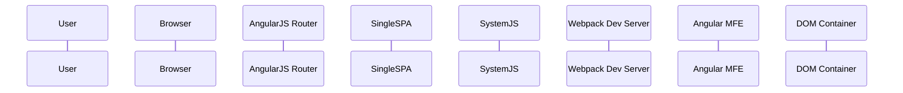
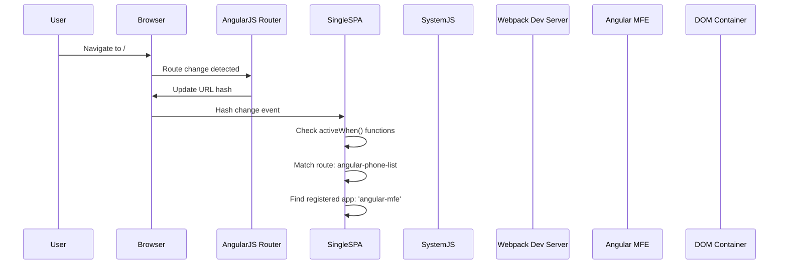
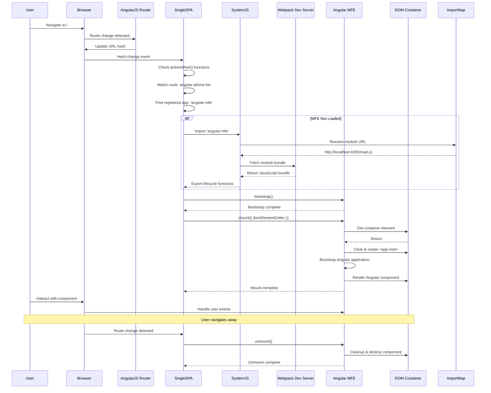
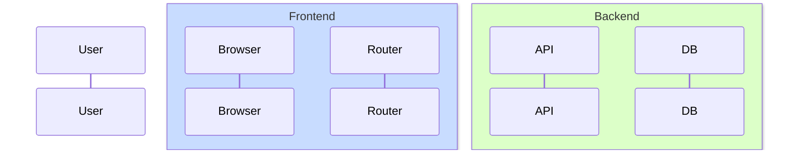
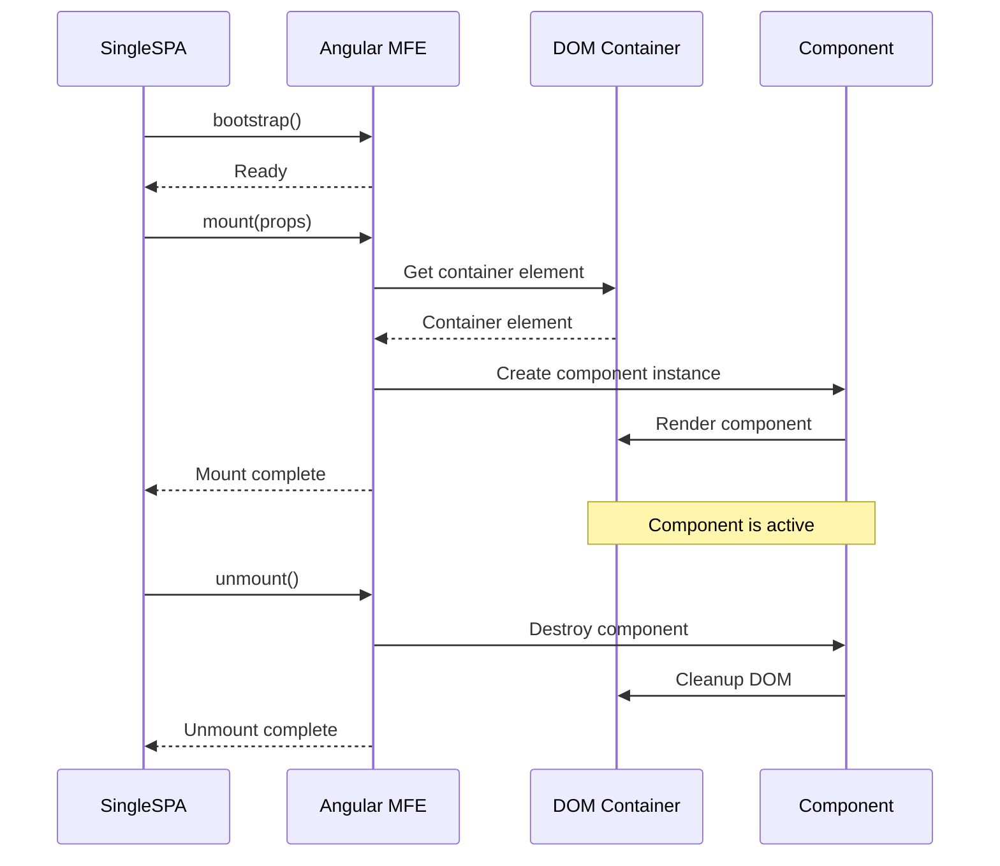

# Hands-On Tutorial: Creating "Runtime Flow: Request to Render" Diagram
**Step-by-Step Guide to Building Sequence Diagrams**

---

## 🎯 Goal
Create a sequence diagram showing how a user navigation request flows through your micro-frontend architecture.

---

## 📋 Step 1: Identify Your Actors

**Participants** in your flow:
1. **User** - The person clicking/navigating
2. **Browser** - The web browser
3. **AngularJS Router** - Handles routing in AngularJS
4. **Single-SPA** - Micro-frontend orchestrator
5. **SystemJS** - Module loader
6. **Webpack Dev Server** - Serves the Angular bundle (or production server)
7. **Angular MFE** - Your Angular micro-frontend application
8. **DOM Container** - Where the component renders

**Tip**: List all entities that participate in the flow. Use descriptive names!

---

## 📋 Step 2: Map the Flow

### Phase 1: Initial Request
```
User → Browser: User clicks link/navigates
Browser → AngularJS Router: Route change detected
AngularJS Router → Browser: Updates URL hash
Browser → Single-SPA: Fires hash change event
```

### Phase 2: Route Matching
```
Single-SPA → Single-SPA: Check if route matches activeWhen()
Single-SPA → Single-SPA: Match found: 'angular-phone-list'
Single-SPA → Single-SPA: Find registered app: 'angular-mfe'
```

### Phase 3: Load Module (if not loaded)
```
IF module not loaded:
  Single-SPA → SystemJS: Import 'angular-mfe'
  SystemJS → Import Map: Resolve module URL
  Import Map → SystemJS: Return URL (http://localhost:4200/main.js)
  SystemJS → Webpack: Fetch JavaScript bundle
  Webpack → SystemJS: Return bundle code
  SystemJS → Single-SPA: Export lifecycle functions
```

### Phase 4: Bootstrap
```
Single-SPA → Angular MFE: Call bootstrap()
Angular MFE → Single-SPA: Bootstrap complete
```

### Phase 5: Mount
```
Single-SPA → Angular MFE: Call mount(props)
Angular MFE → DOM: Get container element by ID
DOM → Angular MFE: Return container element
Angular MFE → DOM: Clear container, create <app-root>
Angular MFE → Angular MFE: Bootstrap Angular app to container
Angular MFE → DOM: Render Angular component
Angular MFE → Single-SPA: Mount complete
```

### Phase 6: User Interaction
```
User → Browser: Interacts with component
Browser → Angular MFE: Handle user events
```

### Phase 7: Unmount (when navigating away)
```
Browser → Single-SPA: Route change detected
Single-SPA → Angular MFE: Call unmount()
Angular MFE → DOM: Cleanup and destroy component
Angular MFE → Single-SPA: Unmount complete
```

---

## 🛠️ Step 3: Write the Mermaid Code

### Start with Basic Structure



**Key Points**:
- `sequenceDiagram` starts a sequence diagram
- `participant` defines each actor
- Use `as` to give shorter aliases for long names
- Order matters! Left to right = User to DOM

---

### Add Messages (Phase 1-2)



**Message Types**:
- `->>` = Async message (solid arrow, outgoing)
- `-->>` = Return message (dashed arrow, response)
- Self-messages: `A->>A: Do something`

---

### Add Conditional Block (Phase 3)

```mermaid
    alt MFE Not Loaded
        SingleSPA->>SystemJS: Import 'angular-mfe'
        SystemJS->>ImportMap: Resolve module URL
        ImportMap-->>SystemJS: http://localhost:4200/main.js
        SystemJS->>Webpack: Fetch module bundle
        Webpack-->>SystemJS: Return JavaScript bundle
        SystemJS-->>SingleSPA: Export lifecycle functions
    end
```

**Conditional Syntax**:
- `alt Condition` starts alternative block
- `else` adds another condition (optional)
- `end` closes the block
- Use `-->>` for return/responses

---

### Add Bootstrap & Mount (Phase 4-5)

```mermaid
    SingleSPA->>Angular_MFE: bootstrap()
    Angular_MFE-->>SingleSPA: Bootstrap complete
    
    SingleSPA->>Angular_MFE: mount({ domElementGetter })
    Angular_MFE->>DOM: Get container element
    DOM-->>Angular_MFE: Return #angular-mfe-container
    Angular_MFE->>DOM: Clear & create <app-root>
    Angular_MFE->>Angular_MFE: Bootstrap Angular application
    Angular_MFE->>DOM: Render Angular component
    Angular_MFE-->>SingleSPA: Mount complete
```

---

### Add User Interaction & Unmount (Phase 6-7)

```mermaid
    User->>Browser: Interact with component
    Browser->>Angular_MFE: Handle user events
    
    Note over User,DOM: User navigates away
    
    Browser->>SingleSPA: Route change detected
    SingleSPA->>Angular_MFE: unmount()
    Angular_MFE->>DOM: Cleanup & destroy component
    Angular_MFE-->>SingleSPA: Unmount complete
```

**Adding Notes**:
- `Note over A,B: Text` - Note spanning multiple actors
- `Note right of A: Text` - Note to the right
- `Note left of A: Text` - Note to the left

---

## 🎨 Step 4: Put It All Together

**Complete Diagram**:



---

## 🔧 Step 5: Test & Refine

### Using Mermaid Live Editor

1. **Open**: https://mermaid.live
2. **Paste your code** in the left panel
3. **See preview** instantly in the right panel
4. **Adjust** until it looks good
5. **Export** as PNG/SVG when ready

### Common Adjustments:

#### Too many actors? Group them!


#### Need activation boxes? (Automatic in Mermaid)
Activation boxes appear automatically when a participant sends or receives messages.

#### Want to show parallel operations?
```mermaid
    par Parallel operations
        A->>B: Operation 1
    and
        A->>C: Operation 2
    end
```

#### Want to show loops?
```mermaid
    loop For each item
        A->>B: Process item
    end
```

---

## 📐 Step 6: Design Principles

### ✅ DO:
- **Start with the user** (leftmost participant)
- **Show the happy path first**
- **Use clear, action-oriented message labels**
- **Group related operations** with alt/loop/par
- **Show return values** when important
- **Add notes** for complex steps
- **Keep it readable** - max 8-10 participants

### ❌ DON'T:
- Don't include every detail (focus on the flow)
- Don't mix multiple scenarios (use separate diagrams)
- Don't use vague message names
- Don't forget return messages
- Don't make it too wide (hard to read)

---

## 🎨 Step 7: Visual Polish (Optional)

### Using Draw.io for Final Touch

1. **Create sequence diagram** in Draw.io
2. **Import** or recreate the flow
3. **Customize colors**:
   - Different colors for different system types
   - Highlight important messages
4. **Add styling**:
   - Bold important messages
   - Different line styles for sync/async
5. **Export high-res PNG** (for presentations)

---

## 💡 Pro Tips

### Tip 1: Version Control
Keep your Mermaid code in markdown files - it's text-based and diff-friendly!

### Tip 2: Iterate Quickly
Use Mermaid Live Editor for rapid prototyping, then save to your docs.

### Tip 3: Document Complex Steps
Use notes to explain "why" not just "what".

### Tip 4: Show Error Paths
Don't just show the happy path - include error handling:

```mermaid
    alt Success
        API-->>Frontend: 200 OK
    else Error
        API-->>Frontend: 500 Error
        Frontend->>User: Show error message
    end
```

### Tip 5: Break Complex Flows
If your diagram has 15+ messages, consider splitting into multiple diagrams:
- High-level overview
- Detailed sub-flows

---

## 📚 Quick Reference

### Message Types:
```
A->>B    Async message (solid arrow)
A-->>B   Return message (dashed arrow)
A-xB     Lost message
A--xB    Lost return
```

### Control Structures:
```
alt Condition
    ...
else Other condition
    ...
end

opt Optional
    ...
end

loop Every time
    ...
end

par Parallel
    ...
and
    ...
end
```

### Notes:
```
Note over A,B: Text spanning A and B
Note right of A: Text to the right
Note left of A: Text to the left
```

---

## 🚀 Practice Exercise

Try creating a diagram for a different flow:

**"Component Lifecycle: Mount to Unmount"**

**Actors**: Single-SPA, Angular MFE, DOM Container

**Flow**:
1. Single-SPA calls bootstrap()
2. Single-SPA calls mount()
3. Angular MFE creates component
4. Component renders
5. User interacts
6. Single-SPA calls unmount()
7. Component cleans up

**Solution** (Try it yourself first!):

<details>
<summary>Click to see solution</summary>



</details>

---

## 📖 Next Steps

1. **Practice**: Create diagrams for other flows in your architecture
2. **Refine**: Improve existing diagrams based on this guide
3. **Document**: Add diagrams to your architecture documentation
4. **Share**: Include in presentations and design docs

---

*Now you have the tools and knowledge to create professional sequence diagrams! Start with Mermaid Live Editor and iterate quickly.* 🎉

