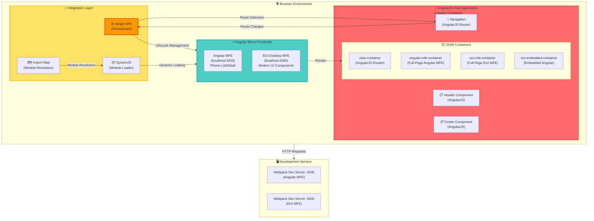
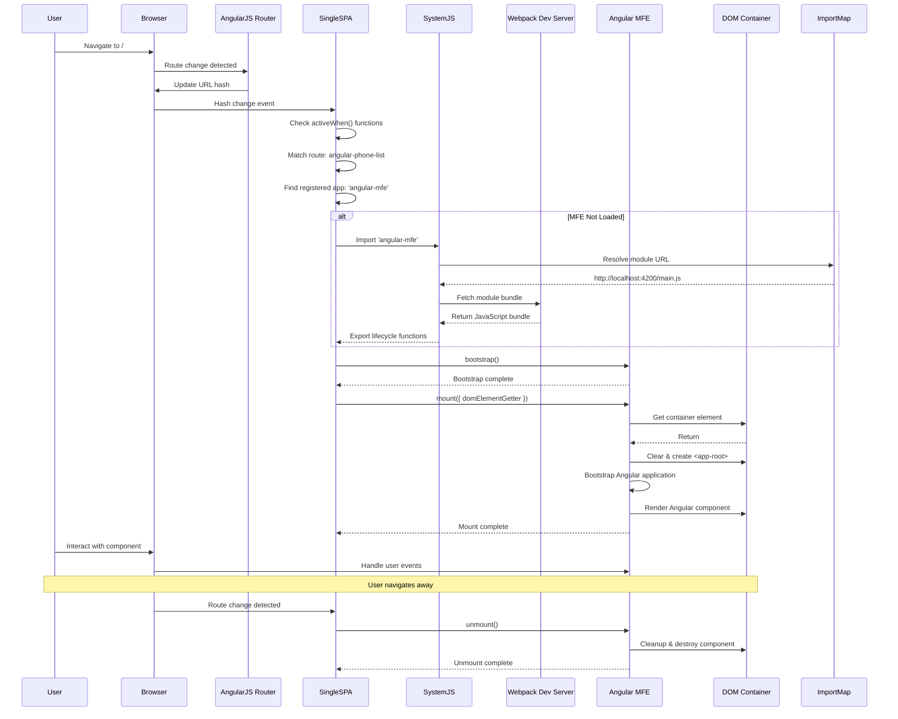
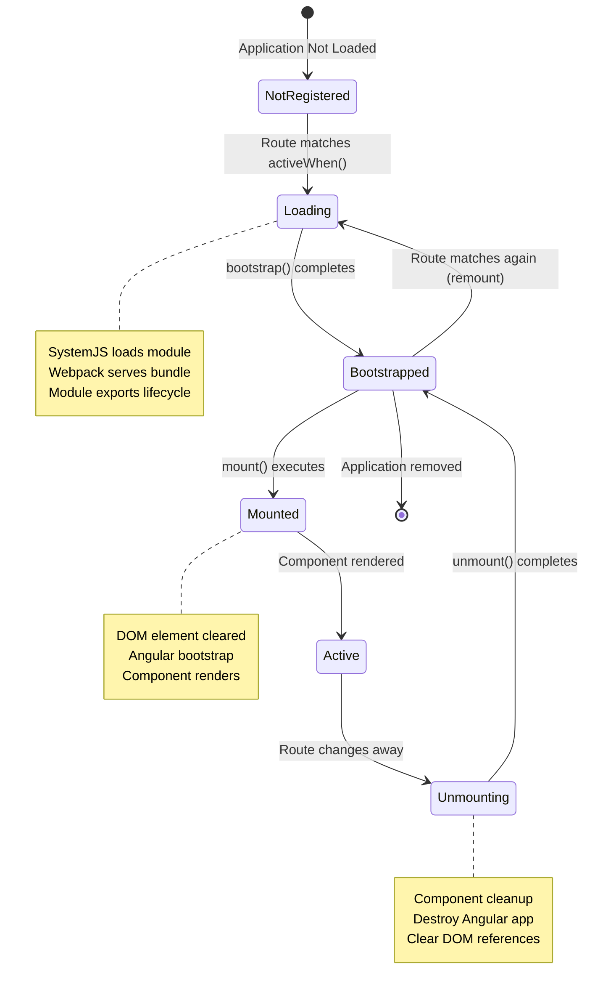
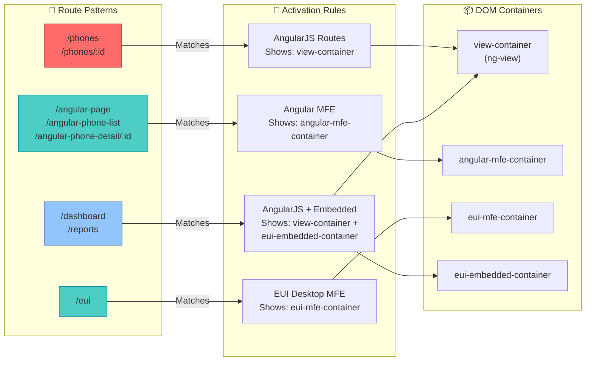
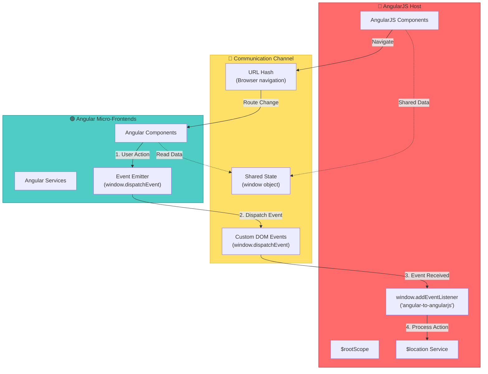
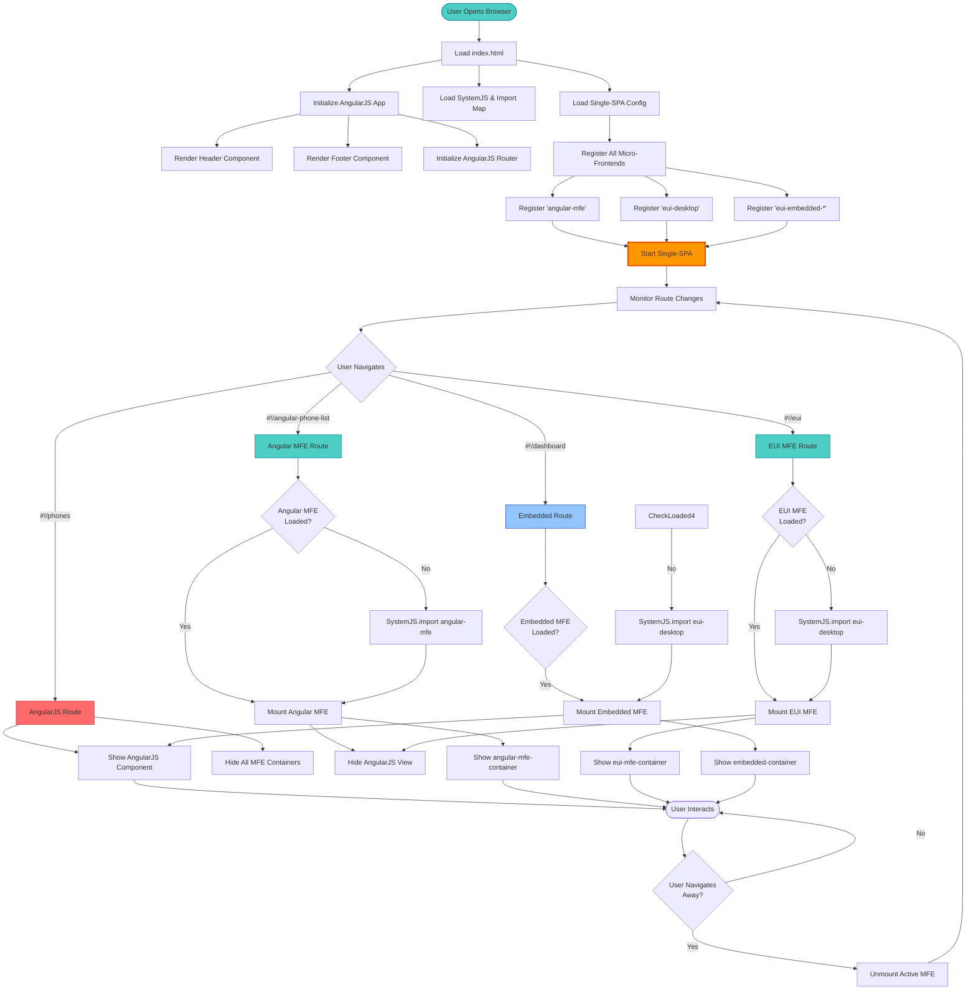
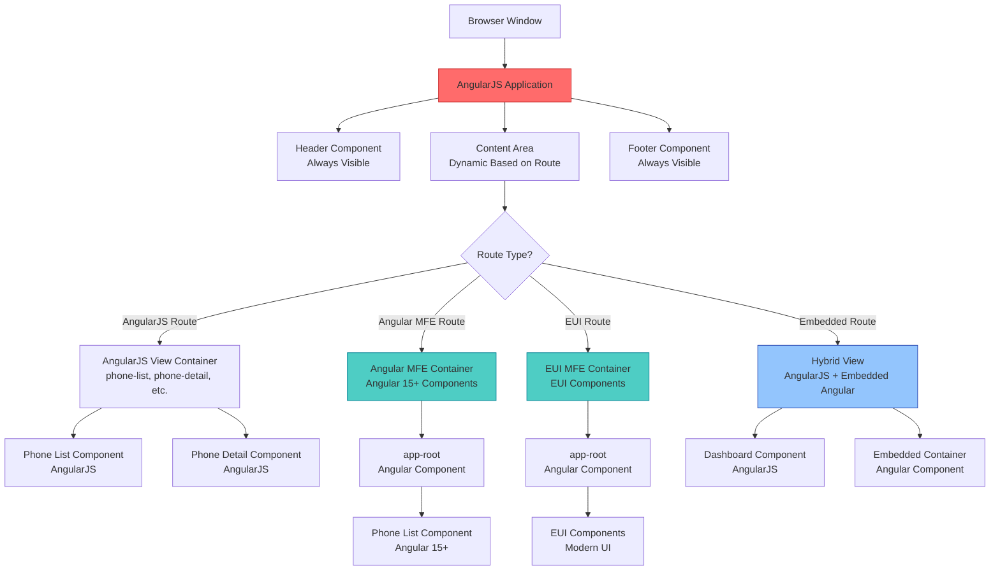
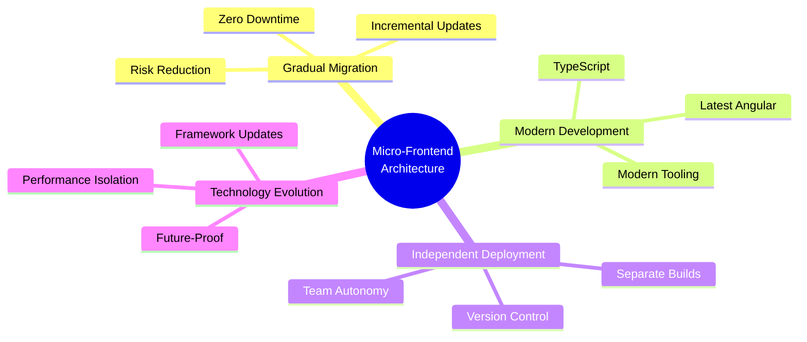

# Micro-Frontend (MFE) Architecture Diagram
**Complete Visual Representation of Angular-in-AngularJS Migration Architecture**

---

## 🏗️ High-Level Architecture Overview



---

## 🌊 Runtime Flow: Request to Render



---

## 🔄 Component Lifecycle Management



---

## 🗺️ Route-Based Activation Matrix



---

## 📡 Cross-Framework Communication



---

## 🔌 Single-SPA Application Registration

```mermaid
graph TD
    Start[Browser Loads index.html] --> LoadSystemJS[Load SystemJS]
    LoadSystemJS --> LoadImportMap[Load Import Map]
    
    LoadImportMap --> Config{
        Import Map Config
    }
    
    Config -->|single-spa| CDN1[CDN: single-spa.min.js]
    Config -->|angular-mfe| Local1[localhost:4200/main.js]
    Config -->|eui-desktop| Local2[localhost:4300/main.js]
    
    LoadSystemJS --> LoadConfig[Load microfrontend-config.js]
    
    LoadConfig --> Register1[Register 'angular-mfe']
    LoadConfig --> Register2[Register 'eui-desktop']
    LoadConfig --> Register3[Register 'eui-embedded-*']
    
    Register1 --> ActiveWhen1{
        activeWhen:<br/>hash.includes<br/>('angular-phone-list')
    }
    
    Register2 --> ActiveWhen2{
        activeWhen:<br/>hash.includes('eui')
    }
    
    Register3 --> ActiveWhen3{
        activeWhen:<br/>hash.includes('phones'/<br/>'dashboard'/'reports')
    }
    
    ActiveWhen1 -->|True| Mount1[Load & Mount Angular MFE]
    ActiveWhen2 -->|True| Mount2[Load & Mount EUI MFE]
    ActiveWhen3 -->|True| Mount3[Load & Mount Embedded]
    
    Register1 --> StartSPA[Start Single-SPA]
    Register2 --> StartSPA
    Register3 --> StartSPA
    
    StartSPA --> Monitor[Monitor Route Changes]
    
    style Register1 fill:#4ecdc4,stroke:#0c8599
    style Register2 fill:#4ecdc4,stroke:#0c8599
    style Register3 fill:#93c5fd,stroke:#1e40af
    style StartSPA fill:#ff9800,stroke:#e65100,stroke-width:3px
```

---

## 📦 Module Loading & Bundle Structure

```mermaid
graph TB
    subgraph HostApp["🏠 AngularJS Host App"]
        IndexHTML[index.html]
        ConfigJS[microfrontend-config.js]
        AppModule[app.module.js]
        Routes[app.config.js]
    end
    
    subgraph SystemJS_Layer["📦 SystemJS Layer"]
        ImportMap["Import Map<br/>{<br/>  'single-spa': CDN,<br/>  'angular-mfe': :4200,<br/>  'eui-desktop': :4300<br/>}"]
        ModuleLoader[System.import()]
    end
    
    subgraph Angular_MFE_4200["⚡ Angular MFE (Port 4200)"]
        Webpack1[Webpack Dev Server]
        Entry1[main.single-spa.ts]
        Bundle1[main.js<br/>System Module Format]
        Components1[Angular Components]
    end
    
    subgraph EUI_MFE_4300["🎨 EUI Desktop MFE (Port 4300)"]
        Webpack2[Webpack Dev Server]
        Entry2[main.single-spa.ts]
        Bundle2[main.js<br/>System Module Format]
        Components2[EUI Components]
    end
    
    IndexHTML -->|Loads| ConfigJS
    IndexHTML -->|Contains| ImportMap
    ConfigJS -->|Uses| ModuleLoader
    ModuleLoader -->|Resolves via| ImportMap
    
    ImportMap -->|'angular-mfe'| Bundle1
    ImportMap -->|'eui-desktop'| Bundle2
    
    Webpack1 -->|Serves| Bundle1
    Webpack2 -->|Serves| Bundle2
    
    Entry1 -->|Compiles to| Bundle1
    Entry2 -->|Compiles to| Bundle2
    
    Bundle1 -->|Exports| Lifecycle1[bootstrap, mount, unmount]
    Bundle2 -->|Exports| Lifecycle2[bootstrap, mount, unmount]
    
    style HostApp fill:#ff6b6b,stroke:#c92a2a
    style Angular_MFE_4200 fill:#4ecdc4,stroke:#0c8599
    style EUI_MFE_4300 fill:#93c5fd,stroke:#1e40af
    style SystemJS_Layer fill:#ffe066,stroke:#fab005
```

---

## 🎯 Complete Integration Flow



---

## 🏛️ Project Structure with MFE Integration

```
angular-phonecat/
│
├── 📱 AngularJS Host Application
│   ├── app/
│   │   ├── index.html                 # ← SystemJS, Import Map, Containers
│   │   ├── app.module.js              # ← Event listeners for cross-framework comm
│   │   ├── app.config.js              # ← Route definitions
│   │   ├── microfrontend-config.js    # ← Single-SPA registration
│   │   ├── phone-list/                # ← Legacy AngularJS components
│   │   ├── phone-detail/              # ← Legacy AngularJS components
│   │   └── dashboard/                 # ← AngularJS with embedded MFE
│   │
│   └── lib/                           # ← AngularJS dependencies
│
├── ⚡ Angular Micro-Frontend (Port 4200)
│   └── angular-mfe/
│       ├── src/
│       │   ├── main.single-spa.ts     # ← bootstrap, mount, unmount
│       │   └── app/
│       │       ├── app.component.ts   # ← Root component
│       │       └── phone-list/        # ← Modern Angular components
│       ├── webpack.config.js          # ← System module format
│       └── dist/                      # ← Built bundles
│
├── 🎨 EUI Desktop Micro-Frontend (Port 4300)
│   └── eui-ng-microfrontend/
│       ├── src/
│       │   ├── main.single-spa.ts     # ← bootstrap, mount, unmount
│       │   └── app/                   # ← EUI components
│       ├── webpack.single-spa.config.js
│       └── dist/
│
└── 🌐 Browser Runtime
    ├── SystemJS Import Map
    │   ├── single-spa → CDN
    │   ├── angular-mfe → localhost:4200
    │   └── eui-desktop → localhost:4300
    │
    ├── Single-SPA Orchestrator
    │   ├── Route Monitoring
    │   ├── Lifecycle Management
    │   └── Application Registry
    │
    └── DOM Containers
        ├── #angular-mfe-container
        ├── #eui-mfe-container
        ├── #eui-embedded-container
        └── .view-container (AngularJS)
```

---

## 🎨 Visual Component Hierarchy



---

## 📊 Migration Strategy Visualization

```mermaid
gantt
    title Micro-Frontend Migration Timeline
    dateFormat YYYY-MM-DD
    section Foundation
    Single-SPA Setup           :done, foundation1, 2024-01-01, 2w
    SystemJS Configuration     :done, foundation2, after foundation1, 1w
    Angular MFE Scaffold       :done, foundation3, after foundation2, 1w
    section Phase 1
    Phone List Migration       :done, phase1-1, after foundation3, 2w
    Phone Detail Migration     :done, phase1-2, after phase1-1, 2w
    section Phase 2
    EUI Integration            :done, phase2-1, after phase1-2, 2w
    Embedded Components        :done, phase2-2, after phase2-1, 2w
    section Phase 3
    Dashboard Migration        :active, phase3-1, 2024-03-01, 3w
    Reports Migration          :phase3-2, after phase3-1, 3w
    section Future
    Additional Components      :future, phase4-1, after phase3-2, 4w
    Complete Migration         :future, phase4-2, after phase4-1, 12w
```

---

## 🔍 Key Integration Points

| Integration Point | Technology | Purpose |
|------------------|------------|---------|
| **Module Loading** | SystemJS | Dynamic loading of Angular bundles |
| **Module Resolution** | Import Maps | URL mapping for module names |
| **Lifecycle Management** | Single-SPA | Mount/unmount coordination |
| **Route Detection** | Hash-based routing | AngularJS hash + Single-SPA activeWhen |
| **DOM Mounting** | Container Elements | Isolated rendering spaces |
| **Communication** | Custom Events | Cross-framework messaging |
| **State Sharing** | Window object | Shared data between frameworks |
| **Asset Loading** | Webpack Dev Server | Development-time asset serving |

---

## ✅ Benefits Visualization



---

*This diagram provides a comprehensive visual guide to the micro-frontend architecture, showing how modern Angular components integrate seamlessly with legacy AngularJS applications using Single-SPA orchestration.*

